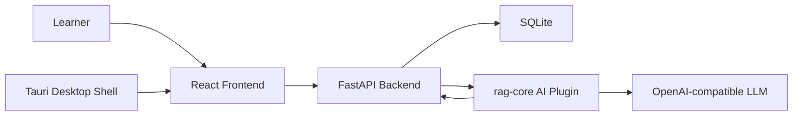

# ai-memory-card

<div align="center">

**A local-first intelligent review system for serious knowledge work.**  
**面向专业课程学习场景的本地优先智能复习系统。**

<br />


<br />

<p>
  <a href="README.zh-CN.md">中文 README (Chinese README)</a> ·
  <a href="docs/onboarding-guide.md">New Developer Onboarding Guide</a> ·
  <a href="https://github.com/WorldIWave/ai-memory-card/releases">Download App</a>
</p>

<p>
  <sub>Prefer Chinese docs? Start with the Chinese README. New contributors can use the onboarding guide as the project map.</sub>
</p>

</div>

---

## What It Is

ai-memory-card turns heavy course materials into reviewable knowledge, then uses large language models to check whether the learner actually understands the idea behind each card.

It is built for AI, computer science, engineering, and other concept-dense courses where "I have seen this before" is not the same as "I can explain, apply, and avoid the common traps."

In one loop:

1. Import textbooks, lecture notes, markdown notes, or structured text.
2. Generate knowledge units and memory cards for spaced repetition.
3. Ask the learner to actively explain a concept.
4. Evaluate understanding across concept, mechanism, boundary, and misconception dimensions.
5. Schedule the next review with either a traditional policy or an optional AI/RL-assisted policy.

## Choose Your Path

There are two ways to use this project, depending on whether you want to **use the app** or **develop the app**.

### For Users: Download and Run

If you only want to use the desktop app, open [GitHub Releases](https://github.com/WorldIWave/ai-memory-card/releases) and download the package that matches your need:

- **Windows installer (`.msi`)**: recommended for most users who want a normal install experience.
- **Portable archive (`.zip`)**: unzip it anywhere and run `AI Memory Card.exe` directly.

Normal users do **not** need to install Python, Rust, Node.js, Conda, or clone the source code. The Windows release package includes the desktop shell, backend runtime, local SQLite storage, and the embedded Python runtime needed by the bundled backend/plugin services.

### For Developers: Run from Source

If you want to modify the frontend, backend, desktop shell, scheduler, or AI plugin, follow the developer setup commands in [Getting Started](#getting-started-developers). This path needs the development toolchain because you are running and rebuilding the project from source.

## 中文简介

ai-memory-card 是一套面向专业课程学习的智能复习系统。它不是单纯的背诵工具，而是把“资料导入、知识卡生成、主动解释评估、个性化复习调度”串成一个本地可运行的学习闭环。

项目适合两类人：

- 学习者：希望把教材、讲义、笔记沉淀成可复习、可诊断、可长期维护的知识库。
- 开发者与研究者：希望在一个真实桌面应用中继续扩展 RAG、理解评估、调度策略或 UACIS 相关实验。

## Why It Feels Different

- **Memory cards with structure.** Cards are connected to knowledge units instead of floating as isolated notes.
- **Understanding-aware review.** The system can inspect the learner's own explanation, not only a button click.
- **Local-first by default.** SQLite, runtime files, and review history stay on the user's machine.
- **Pluggable AI.** The RAG/evaluation/scheduling capability lives in a plugin boundary, so the app can work with local or OpenAI-compatible providers.
- **Research without leaking into product code.** UACIS and scheduling experiments are integrated through a clean decision interface, while historical experiment outputs are kept out of the public repo.

## System Shape



The backend owns durable state. The AI plugin can generate cards, evaluate explanations, and suggest schedule changes, but final review state is still written by the FastAPI service layer.

## Repository Layout

```text
.
├─ apps/local-web/backend/          FastAPI, SQLite models, services, API routes
├─ apps/local-web/frontend/         React, Vite, TypeScript UI
├─ apps/local-web/desktop/          Tauri shell, runtime packaging, Windows release scripts
├─ apps/local-web/plugins/rag-core/ AI plugin runtime for RAG, evaluation, scheduling advice
├─ docs/onboarding-guide.md         New developer onboarding guide and project map
├─ docs/development.md              Engineering boundaries and verification policy
├─ docs/integration/                Provider integration notes
├─ docs/release/                    Windows packaging and smoke-test docs
└─ .github/workflows/ci.yml         Public CI checks
```

## Core Modules

| Area | Key files | Responsibility |
| --- | --- | --- |
| Cards and decks | `backend/app/services/card_service.py`, `deck_service.py` | Card CRUD, deck/folder organization |
| RAG import | `backend/app/services/rag_import_service.py`, `plugins/rag-core/runtime/app/pipeline_service.py` | Source parsing, knowledge units, generated cards |
| Understanding evaluation | `backend/app/services/evaluation_service.py` | Learner explanation scoring and persistence |
| Review loop | `backend/app/services/review_service.py` | Session queue, answer submission, review logs |
| AI/RL scheduling bridge | `backend/app/services/ai_scheduler_decision_service.py` | Optional AI/RL interval suggestion, validation, fallback |
| Activity analytics | `backend/app/services/activity_service.py`, `analytics_service.py` | Learning events and review analytics |

## Scheduler Modes

The app supports two scheduling modes from Settings:

- **Traditional scheduling** uses the built-in review scheduler as the stable baseline.
- **AI/RL scheduling** keeps the same review flow, but lets the AI plugin suggest the next interval. Only the scheduling result changes. Card content, review logging, and final persistence remain in the backend.

This makes the experimental scheduler useful without letting it take over the whole learning workflow.

## Getting Started (Developers)

This section is for contributors and researchers who want to run or modify the source code. If you only want to use the app, download the `.msi` or `.zip` release package instead.

### 1. Clone

```powershell
git clone https://github.com/WorldIWave/ai-memory-card.git
cd ai-memory-card
```

### 2. Backend

```powershell
cd apps/local-web/backend
conda env create -f environment.yml
conda activate ai-memory-card-backend
pip install -e .
alembic upgrade head
uvicorn app.main:app --reload --port 8765
```

### 3. Frontend

```powershell
cd apps/local-web/frontend
npm install
npm run dev
```

Open the Vite URL in a browser for web development.

### 4. Desktop App

```powershell
cd apps/local-web/desktop
npm install
npm run doctor
npm run dev
```

The desktop script starts the Tauri shell and connects it to the local backend/frontend runtime.

### 5. AI Plugin

The built-in plugin lives at `apps/local-web/plugins/rag-core`.

```powershell
cd apps/local-web/plugins/rag-core
python -m pytest tests runtime/tests -q
```

Configure provider settings in the app Settings page before using RAG import, explanation evaluation, or AI/RL scheduling.

## Verification

Run these before opening a pull request:

```powershell
pytest apps/local-web/backend/tests -q

cd apps/local-web/frontend
npm test
npm run build

cd ../desktop
npm run test:doctor
npm run test:prepare-release
npm run test:release-local
npm run test:portable
npm run test:run-tauri
npm run test:rust:raw -- data_directory

cd ../plugins/rag-core
python -m pytest tests runtime/tests -q
```

The public CI mirrors the same layers: backend, frontend, desktop scripts, and plugin runtime.

## Data Safety

This repository intentionally excludes:

- SQLite databases and journals.
- Logs, backups, runtime cache, plugin state, and temporary files.
- `node_modules`, frontend `dist`, Rust `target`, Tauri release staging/output.
- Research experiment outputs, checkpoints, thesis drafts, and personal machine paths.
- `.env` files and API keys.

See [docs/onboarding-guide.md](docs/onboarding-guide.md) for the cleanup rationale and [docs/development.md](docs/development.md) for contribution boundaries.

## Roadmap

- Add polished screenshots and a short demo video after the first public release.
- Expand provider adapters for more local and remote LLM runtimes.
- Add deeper analytics for misconception patterns and review load.
- Keep the UACIS scheduler boundary narrow: strategy can evolve, but backend state remains authoritative.

## Contributing

Small, focused pull requests are welcome. Good first areas include UI polish, provider adapters, tests, import formats, documentation, and scheduler diagnostics.

Please keep product code separate from research outputs. If you add a new experiment, document the runner and keep generated artifacts outside the repository.

## Citation

If this project helps your work, you can cite it as:

```bibtex
@software{ai_memory_card_2026,
  title        = {ai-memory-card: A Local-First Intelligent Review System with RAG and Understanding-Aware Scheduling},
  author       = {AI Memory Card Contributors},
  year         = {2026},
  url          = {https://github.com/WorldIWave/ai-memory-card}
}
```

## License

MIT. See [LICENSE](LICENSE).
