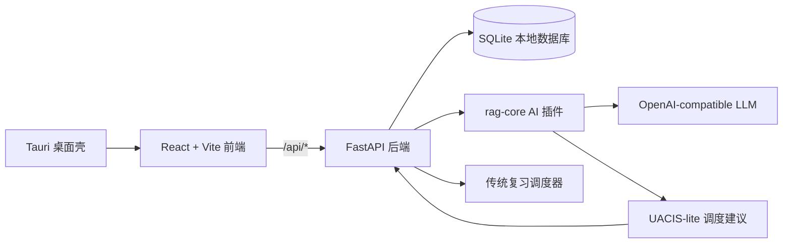

<div align="center">

  

  <h1>ai-memory-card</h1>

  <p>
    <strong>基于大模型 RAG 与 UACIS（理解感知认知干预选择器）的本地优先智能复习系统。</strong>
  </p>

  <p>
    将课程材料转化为结构化记忆卡片，将主动解释转化为认知诊断，
    在固定学习预算下生成更个性化的复习与干预策略。
  </p>

  <p>
    <a href="https://github.com/WorldIWave/ai-memory-card/stargazers">
      
    </a>
    <a href="#license">
      
    </a>
    <a href="https://github.com/WorldIWave/ai-memory-card/releases">
      
    </a>
    
    
    
    
    
  </p>

  <p>
    <a href="README.md">English</a>
    ·
    <a href="#citation--acknowledgements">📄 论文引用</a>
    ·
    <a href="#showcase">🎬 演示视频</a>
    ·
    <a href="#getting-started">⚡ 安装指南</a>
    ·
    <a href="docs/onboarding-guide.md">🧭 新手指北</a>
    ·
    <a href="docs/development.md">🛠️ 开发文档</a>
  </p>

</div>

---

## 🔥 项目概览

**ai-memory-card** 是一个面向专业课程和概念密集型学习场景的本地优先智能复习应用。它结合了 Tauri 桌面壳、React 前端、FastAPI 后端、SQLite 本地持久化，以及可选的 AI 能力插件；插件可接入兼容 OpenAI 格式的本地或云端 LLM 服务。

项目围绕三个核心目标构建：**结构化知识重组**、**主动解释式理解诊断**、以及 **固定认知预算下的个性化复习调度**。

---

## Showcase

眼见为实。下面预留了高清 GIF 与界面截图位置。正式发布前，可将真实演示素材放入 `assets/readme/` 并替换对应文件。

<table>
  <tr>
    <td align="center" width="33%">
      
      <br />
      <sub><strong>RAG 知识导入</strong><br />教材 / 讲义 / 笔记 → 结构化知识单元 → 多类型卡片</sub>
    </td>
    <td align="center" width="33%">
      
      <br />
      <sub><strong>主动解释诊断</strong><br />学习者解释 → 概念 / 机制 / 边界 / 误区评分</sub>
    </td>
    <td align="center" width="33%">
      
      <br />
      <sub><strong>UACIS 智能调度</strong><br />在固定预算下选择更合适的认知干预动作</sub>
    </td>
  </tr>
</table>

---

## Key Features

- 📄 **结构化知识重组（RAG 增强提取）**  
  将课程材料拆解为可追踪的知识单元，并自动生成 recall、understanding、boundary 等多类型复习卡片。

- 🧠 **深层理解诊断（主动解释取代死记硬背）**  
  学习者用自己的话解释知识点，系统评估掌握度、机制理解、边界意识和潜在误区。

- ⏱️ **智能调度 UACIS（固定预算下的最佳干预）**  
  在有限每日复习负担内，选择普通复习、解释、诊断、误区修复、边界辨析或迁移练习等干预方式。

- 🔒 **本地优先设计**  
  卡片、复习记录、学习事件、设置和备份默认保存在本机 SQLite 中，AI 插件只返回结果和建议。

- 🧩 **可插拔 AI 能力层**  
  `rag-core` 插件暴露 `rag.generate_cards`、`evaluation.score_explanation`、`scheduler.plan_review` 三类核心能力。

- 🖥️ **桌面应用工作流**  
  Tauri 将 React 前端和 FastAPI 后端包装成 Windows 本地桌面应用，适合长期资料管理和日常复习。

---

## How it Works

应用遵循紧凑的本地优先数据流：**Tauri** 启动桌面壳和本地运行时；**React** 渲染学习工作台；**FastAPI** 负责 API 路由和业务规则；**SQLite** 保存牌组、卡片、知识单元、复习状态、复习日志和学习事件；可选的 **LLM 插件** 负责生成卡片、评估解释，并提供受限的调度调整建议。

<div align="center">
  
  <br />
  <sub>系统架构图占位：Tauri → React → FastAPI → SQLite / rag-core 插件 → OpenAI-compatible LLM。</sub>
</div>



> AI 插件只提供建议。生成内容和调度结果必须经过后端验证后，才会写入本地数据库。

---

## 两种使用方式

这个项目有两条入口，请按你的身份选择：

### 普通用户：下载后直接使用

如果你只是想使用桌面应用，请进入 [GitHub Releases](https://github.com/WorldIWave/ai-memory-card/releases)，按需求下载：

- **Windows 安装包（`.msi`）**：适合大多数用户，双击安装后从开始菜单或桌面快捷方式启动。
- **便携压缩包（`.zip`）**：解压到任意文件夹，直接运行 `AI Memory Card.exe`。

普通用户不需要安装 **Python、Rust、Node.js、Conda**，也不需要克隆源码。Windows 发布包已经包含桌面壳、后端运行时、本地 SQLite 存储，以及后端 / 插件服务所需的内置 Python 运行时。

### 开发者：从源码运行和修改

如果你想修改前端、后端、桌面壳、调度算法或 AI 插件，请继续阅读下面的开发者启动步骤。这个路径需要开发工具链，因为你是在本机运行和重新构建源码。

## Getting Started

下面是开发者源码启动流程。普通用户请优先使用上面的 `.msi` 或 `.zip` 发布包。

<details open>
<summary><strong>1. 环境准备</strong></summary>

请先确认以下工具可用：

- **Git**
- **Conda**，并支持 Python 3.11
- **Node.js** 与 npm
- **Rust + Cargo**，用于 Tauri 桌面壳
- 可选：一个 **OpenAI-compatible LLM endpoint**，用于 RAG 生成和主动解释评估

</details>

<details open>
<summary><strong>2. 安装步骤</strong></summary>

克隆仓库：

```powershell
git clone https://github.com/WorldIWave/ai-memory-card.git
cd ai-memory-card
```

创建后端环境：

```powershell
cd apps/local-web/backend
conda env create -f environment.yml
conda activate ai-memory-card-backend
```

安装前端依赖：

```powershell
cd ../frontend
npm install
```

安装桌面端依赖：

```powershell
cd ../desktop
npm install
npm run doctor
```

</details>

<details open>
<summary><strong>3. 启动项目</strong></summary>

启动后端 API：

```powershell
cd apps/local-web/backend
conda activate ai-memory-card-backend
uvicorn app.main:app --reload
```

启动前端应用：

```powershell
cd apps/local-web/frontend
npm run dev
```

浏览器打开：

```text
http://127.0.0.1:5173
```

启动桌面壳：

```powershell
cd apps/local-web/desktop
npm run dev
```

> 使用桌面壳时，不要再手动启动第二个后端进程。Tauri 运行时会自动启动并健康检查本地后端。

</details>

<details>
<summary><strong>4. 验证命令</strong></summary>

后端测试：

```powershell
pytest apps/local-web/backend/tests -q
```

前端测试与构建：

```powershell
cd apps/local-web/frontend
npm.cmd test
npm.cmd run build
```

RAG 插件运行时测试：

```powershell
cd apps/local-web/plugins/rag-core
pytest tests runtime/tests -q
```

桌面端检查：

```powershell
cd apps/local-web/desktop
npm.cmd run doctor
npm.cmd run test:rust
```

</details>

---

## Project Structure

```text
apps/local-web/
  backend/            FastAPI 路由、业务服务、SQLite 模型、Alembic 迁移
  frontend/           React/Vite UI、功能模块、API 客户端、国际化
  desktop/            Tauri 壳、Rust 运行时、Windows 发布脚本
  plugins/rag-core/   本地 AI 能力插件：RAG、理解评估、调度建议
docs/
  onboarding-guide.md 新手开发者指北
  development.md      开发与验证说明
  integration/        AI provider 集成说明
  release/            Windows 发布与冒烟测试清单
```

---

## Roadmap

- [ ] 用正式 Logo、界面截图和演示 GIF 替换 README 占位素材。
- [ ] 发布可复现 Demo 包，并内置示例牌组。
- [ ] 在复习会话界面中增强 UACIS 动作可视化。
- [ ] 增加知识单元检查视图和先修关系图。
- [ ] 准备论文 / 技术报告公开发布材料。

---

## Citation & Acknowledgements

如果这个项目对你的研究或学习工具链有帮助，欢迎引用 UACIS 相关工作：

```bibtex
@misc{aimemorycard2026uacis,
  title        = {UACIS: Understanding-Aware Cognitive Intervention Scheduling for Local-First Intelligent Review},
  author       = {AI Memory Card Contributors},
  year         = {2026},
  howpublished = {Technical report},
  note         = {Local-first intelligent review with RAG card generation, active explanation diagnosis, and bounded cognitive intervention scheduling}
}
```

### Acknowledgements

本项目建立在许多优秀开源系统和研究工具之上，包括 **Tauri**、**React**、**FastAPI**、**SQLite**、**SQLModel**、**Alembic**，以及兼容 OpenAI 格式的 LLM 生态。

README 的视觉呈现借鉴了现代 AI 开源项目主页的组织方式：可复现演示、清晰安装步骤、视觉展示区域，以及便于论文引用的研究型表达。

### License

本项目默认采用 **MIT License**。如果你的发行版本使用其他许可证，请同步更新徽章、本节说明和仓库中的 `LICENSE` 文件。
