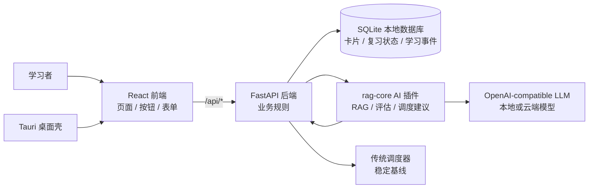

# 新手开发者指北 Onboarding Guide 🚀

欢迎来到 **AI Memory Card**！这份文档写给第一次打开项目的同学：编程初学者、在校学生、刚接触 Tauri / React / FastAPI / SQLite 技术栈的开发者，都可以从这里开始。

你不需要一上来就读懂所有文件。先把这个项目想象成一家“智能学习小店”：**前端是店铺门面**，**后端是后厨**，**SQLite 是账本**，**LLM 是外聘专家**，**Tauri 是把整家店装进桌面应用的外壳**。我们一点点逛。🌱

---

## 🎯 1. 项目是干什么的？一分钟电梯演讲

**AI Memory Card 是一个本地优先的智能复习系统**：它可以把教材、讲义、笔记等学习材料转成知识卡片，并帮助用户按计划复习。  
它还接入了 **LLM + RAG** 来生成卡片、做主动解释诊断，并用 **UACIS / AI-RL 调度建议** 在有限学习时间里安排更合适的复习节奏。  
一句话：**它不是只提醒你“什么时候背”，还试着理解你“哪里没懂、下一步该怎么练”。** 📚

---

## 🍔 2. 核心技术栈速览：架构白话版

可以把系统理解成一家本地运行的学习餐厅：

| 技术 | 它在项目里做什么 | 生活类比 |
| --- | --- | --- |
| **React + TypeScript + Vite** | 展示页面、按钮、表单、复习卡片 | 🧑‍💼 **店铺门面 / 收银员**：用户看到什么、点什么，都先经过它 |
| **FastAPI** | 提供 `/api/*` 接口，处理业务规则 | 👨‍🍳 **后厨**：真正决定卡片怎么存、复习怎么排、AI 结果怎么落库 |
| **SQLite + SQLModel + Alembic** | 保存卡片、牌组、复习记录、设置 | 📒 **账本**：每一张卡、每一次复习、每个设置都记在这里 |
| **Tauri + Rust** | 把前端和后端包装成桌面应用 | 🥡 **外卖盒 / 店门**：让本地 Web 应用变成 Windows 桌面软件 |
| **rag-core AI 插件** | RAG 生成、解释评分、调度建议 | 🧠 **外聘专家**：读材料、出题、评估理解、提出调度建议 |
| **OpenAI-compatible LLM** | 本地或云端大模型服务 | 📚 **专家的大脑**：可以是本地模型，也可以是兼容 OpenAI 接口的云服务 |

核心原则很重要：**本地后端拥有最终状态，AI 插件只给建议**。  
也就是说，AI 可以“出题”和“建议复习间隔”，但真正写入 SQLite 的仍然是 FastAPI 后端。这样更安全，也更容易调试。✅



---

## 🗺️ 3. 代码目录导游图：我们该去哪找代码？

项目主线在 `apps/local-web/`。不要把目录当成“文件清单”，把它当成一座城市地图来看：每片区域负责解决一种问题。

```text
apps/local-web/
  frontend/          React 前端：页面、组件、按钮、表单
  backend/           FastAPI 后端：接口、业务逻辑、数据库
  desktop/           Tauri 桌面壳：启动、打包、Windows 发布
  plugins/rag-core/  AI 插件：RAG 生成、解释评估、调度建议
docs/                给开发者、集成方、发布流程看的文档
```

### 🧑‍💼 前端区：用户看到和点击的地方

前端在 [`apps/local-web/frontend`](../apps/local-web/frontend)。它解决的问题是：**用户怎么操作这个学习系统？**

| 想找什么 | 去哪里 | 怎么理解 |
| --- | --- | --- |
| 应用入口 | [`src/main.tsx`](../apps/local-web/frontend/src/main.tsx) | 把 React 应用挂到页面上，像“开店开灯” |
| 路由表 | [`src/app/router.tsx`](../apps/local-web/frontend/src/app/router.tsx) | 决定 `/`、`/library`、`/settings` 去哪个页面 |
| 左侧导航 / 外壳 | [`src/app/shell.tsx`](../apps/local-web/frontend/src/app/shell.tsx) | 店铺大厅和导航栏 |
| 复习页 | [`src/pages/review-page.tsx`](../apps/local-web/frontend/src/pages/review-page.tsx) | 用户翻卡、评分、撤销的主入口 |
| 牌库页 | [`src/pages/library-page.tsx`](../apps/local-web/frontend/src/pages/library-page.tsx) | 管理文件夹、牌组、卡片、AI 导入 |
| 数据页 | [`src/pages/data-page.tsx`](../apps/local-web/frontend/src/pages/data-page.tsx) | 看学习统计和趋势 |
| 设置页 | [`src/pages/settings-page.tsx`](../apps/local-web/frontend/src/pages/settings-page.tsx) | AI provider、学习上限、调度模式、数据目录等 |
| API 客户端 | [`src/api/client.ts`](../apps/local-web/frontend/src/api/client.ts) | 统一发送 HTTP 请求 |
| 前后端类型 | [`src/api/types.ts`](../apps/local-web/frontend/src/api/types.ts) | 前端理解后端 JSON 的“说明书” |
| 通用 UI 积木 | [`src/components/ui`](../apps/local-web/frontend/src/components/ui) | Button、Card、Modal 等基础组件 |
| 业务组件 | [`src/features`](../apps/local-web/frontend/src/features) | 复习、牌库、设置等具体功能块 |
| 中英文文案 | [`src/i18n/locales`](../apps/local-web/frontend/src/i18n/locales) | 页面上显示的文字 |

前端记忆法：**`pages` 管页面，`features` 管功能，`api` 管请求，`components/ui` 管通用积木。**

### 👨‍🍳 后端区：真正做决定的地方

后端在 [`apps/local-web/backend`](../apps/local-web/backend)。它解决的问题是：**数据怎么变、规则怎么执行、什么能写进账本？**

| 想找什么 | 去哪里 | 怎么理解 |
| --- | --- | --- |
| 后端总入口 | [`app/main.py`](../apps/local-web/backend/app/main.py) | FastAPI 开门营业，注册所有路由 |
| HTTP 接口 | [`app/api/routes`](../apps/local-web/backend/app/api/routes) | 前端点菜的窗口，比如 `/api/review/session` |
| 业务服务 | [`app/services`](../apps/local-web/backend/app/services) | 后厨师傅，真正处理导入、复习、评估、备份 |
| 数据库表结构 | [`app/db/models.py`](../apps/local-web/backend/app/db/models.py) | SQLite 账本模板 |
| 数据库连接 | [`app/db/session.py`](../apps/local-web/backend/app/db/session.py) | 打开账本、写账本的工具 |
| 数据迁移 | [`alembic/versions`](../apps/local-web/backend/alembic/versions) | 升级账本格式的脚本 |
| 请求 / 响应格式 | [`app/schemas`](../apps/local-web/backend/app/schemas) | API 传输数据的形状 |
| 导入器 / 调度器 | [`app/providers`](../apps/local-web/backend/app/providers) | 可替换能力，比如 CSV 导入、基础调度 |
| 后端测试 | [`tests`](../apps/local-web/backend/tests) | 防止改坏核心业务 |

常见接口地图：

| 功能 | route 文件 |
| --- | --- |
| 卡片 | [`app/api/routes/cards.py`](../apps/local-web/backend/app/api/routes/cards.py) |
| 牌组 | [`app/api/routes/decks.py`](../apps/local-web/backend/app/api/routes/decks.py) |
| 文件夹 | [`app/api/routes/folders.py`](../apps/local-web/backend/app/api/routes/folders.py) |
| 普通导入 | [`app/api/routes/imports.py`](../apps/local-web/backend/app/api/routes/imports.py) |
| RAG 导入 / AI 插件状态 | [`app/api/routes/ai.py`](../apps/local-web/backend/app/api/routes/ai.py) |
| 复习 session | [`app/api/routes/review.py`](../apps/local-web/backend/app/api/routes/review.py) |
| 主动解释评估 | [`app/api/routes/evaluations.py`](../apps/local-web/backend/app/api/routes/evaluations.py) |
| 设置 | [`app/api/routes/settings.py`](../apps/local-web/backend/app/api/routes/settings.py) |
| 数据统计 | [`app/api/routes/stats.py`](../apps/local-web/backend/app/api/routes/stats.py) |
| 系统备份 / 诊断 | [`app/api/routes/system.py`](../apps/local-web/backend/app/api/routes/system.py) |

### 📒 数据库区：本地账本在哪里？

数据库模型集中在 [`backend/app/db/models.py`](../apps/local-web/backend/app/db/models.py)。几个重要模型可以这样理解：

| 模型 | 记录什么 |
| --- | --- |
| `Folder` | 文件夹 |
| `Deck` | 牌组 |
| `Card` | 每一张记忆卡 |
| `KnowledgeUnit` | RAG 抽取出的知识单元 |
| `CardReviewState` | 每张卡当前复习状态，比如下次到期时间 |
| `ReviewLog` | 用户每次评分记录：again / hard / good / easy |
| `LearningEvent` | 学习事件，比如笔记、报错、解释评估 |
| `ReviewSession` | 一次复习会话 |
| `AppStudySettings` | 每日学习上限、调度模式等全局设置 |

⚠️ 新手提醒：**改数据库字段不是只改 `models.py`。**  
通常还要同步 Alembic 迁移、schema、service、前端 `api/types.ts` 和测试。

### 🧠 AI 区：LLM 和 RAG 在哪里？

AI 插件在 [`apps/local-web/plugins/rag-core`](../apps/local-web/plugins/rag-core)。它解决的问题是：**如何把模型能力隔离成一个可启动、可测试、可替换的本地服务？**

| 想找什么 | 去哪里 | 怎么理解 |
| --- | --- | --- |
| 插件声明 | [`plugin.json`](../apps/local-web/plugins/rag-core/plugin.json) | 插件“身份证”，声明支持哪些能力 |
| 插件 API 入口 | [`runtime/app/main.py`](../apps/local-web/plugins/rag-core/runtime/app/main.py) | 插件自己的 FastAPI 服务 |
| 请求 / 响应合同 | [`runtime/app/contracts.py`](../apps/local-web/plugins/rag-core/runtime/app/contracts.py) | 插件能接什么任务、返回什么结果 |
| RAG 主流程 | [`runtime/app/pipeline_service.py`](../apps/local-web/plugins/rag-core/runtime/app/pipeline_service.py) | 读文本、抽知识点、生成卡片 |
| UACIS-lite 调度 | [`runtime/app/scheduler_core.py`](../apps/local-web/plugins/rag-core/runtime/app/scheduler_core.py) | 根据理解分数和基础间隔给调度建议 |
| RAG 管线代码 | [`runtime/vendor/textbook_qa`](../apps/local-web/plugins/rag-core/runtime/vendor/textbook_qa) | 被内置进插件的教材问答/知识抽取管线 |

后端与插件之间的桥梁：

- [`AIPluginHostService`](../apps/local-web/backend/app/services/ai_plugin_host_service.py)：负责发现、启动、健康检查插件。
- [`PluginClient`](../apps/local-web/backend/app/providers/ai/plugin_client.py)：负责向插件发 HTTP 请求。
- [`RAGImportService`](../apps/local-web/backend/app/services/rag_import_service.py)：把插件生成的卡片写入 SQLite。
- [`EvaluationService`](../apps/local-web/backend/app/services/evaluation_service.py)：把学习者解释交给插件评分。
- [`AISchedulerDecisionService`](../apps/local-web/backend/app/services/ai_scheduler_decision_service.py)：把 AI/RL 调度建议变成安全可落库的结果。

### 🥡 桌面区：如何变成桌面应用？

桌面壳在 [`apps/local-web/desktop`](../apps/local-web/desktop)。它解决的问题是：**如何把本地 Web 前端 + 本地后端包装成桌面程序？**

| 想找什么 | 去哪里 |
| --- | --- |
| Tauri 配置 | [`src-tauri/tauri.conf.json`](../apps/local-web/desktop/src-tauri/tauri.conf.json) |
| Rust 入口 | [`src-tauri/src/main.rs`](../apps/local-web/desktop/src-tauri/src/main.rs) |
| 后端运行时管理 | [`src-tauri/src/runtime.rs`](../apps/local-web/desktop/src-tauri/src/runtime.rs) |
| 发布 / 检查脚本 | [`scripts`](../apps/local-web/desktop/scripts) |

新手可以先把它理解成“包装盒”。大多数业务功能不在这里改，除非你在处理启动、数据目录、打包、Windows 发布。

---

## 🔄 4. 关键数据流：一张卡片如何从文本变成复习题？

我们挑最核心的一条 Pipeline：**RAG 导入卡片流程**。  
类比一下：用户把教材交给“外聘专家”，专家整理知识点并出题，后厨检查结果，最后写到账本里。

### Step 1：用户在牌库页上传文本 📄

入口在 [`frontend/src/features/library/rag-import-dialog.tsx`](../apps/local-web/frontend/src/features/library/rag-import-dialog.tsx)。  
这个弹窗会读取用户选择的文本文件，整理成：

- 文件名
- 内容类型
- 文本内容
- 目标牌组
- 生成偏好

然后调用：

```text
POST /api/ai/rag/import-cards
```

### Step 2：前端 API 客户端发请求 🚚

请求统一通过 [`frontend/src/api/client.ts`](../apps/local-web/frontend/src/api/client.ts) 发送。  
它负责决定后端地址，并把错误整理成前端能显示的消息。

### Step 3：后端 AI 路由接住请求 🚪

后端入口是 [`backend/app/api/routes/ai.py`](../apps/local-web/backend/app/api/routes/ai.py)。  
这个 route 像窗口服务员：它不亲自出题，而是把任务交给：

```text
RAGImportService.import_generated_cards()
```

对应文件：[`backend/app/services/rag_import_service.py`](../apps/local-web/backend/app/services/rag_import_service.py)。

### Step 4：后端叫醒 rag-core 插件 🧠

[`AIPluginHostService`](../apps/local-web/backend/app/services/ai_plugin_host_service.py) 会确保 `rag-core` 插件启动，并拿到它的本地地址。  
然后 [`PluginClient`](../apps/local-web/backend/app/providers/ai/plugin_client.py) 调用：

```text
POST /tasks/rag.generate_cards
```

这是插件暴露出来的“请帮我根据材料生成卡片”的能力。

### Step 5：插件执行 RAG 生成 🔍

插件入口在 [`plugins/rag-core/runtime/app/main.py`](../apps/local-web/plugins/rag-core/runtime/app/main.py)。  
它会进入 [`pipeline_service.py`](../apps/local-web/plugins/rag-core/runtime/app/pipeline_service.py)，再使用内置的 [`textbook_qa`](../apps/local-web/plugins/rag-core/runtime/vendor/textbook_qa) 管线。

大致做三件事：

1. **读材料**：把上传文本整理成模型能处理的输入。
2. **抽知识单元**：找出概念、公式、条件、误区、例子等。
3. **生成卡片**：输出 `front`、`back`、`card_type`、`tags`、`knowledge_unit` 等结构化结果。

### Step 6：后端写入 SQLite 📒

插件返回结果后，`RAGImportService` 会：

1. 创建或复用 `Deck`。
2. 创建 `Card`。
3. 创建 `KnowledgeUnit`。
4. 用 `knowledge_unit_ref_id` 把卡片和知识单元连起来。

最后前端刷新牌库，用户就能看到新生成的复习卡片。🎉

```text
rag-import-dialog.tsx
  -> /api/ai/rag/import-cards
  -> routes/ai.py
  -> RAGImportService
  -> AIPluginHostService
  -> PluginClient
  -> rag-core /tasks/rag.generate_cards
  -> SQLite: Deck + Card + KnowledgeUnit
```

### Bonus：复习调度是怎么接入 UACIS 的？⏱️

复习主线在 [`backend/app/services/review_service.py`](../apps/local-web/backend/app/services/review_service.py)。  
用户在前端点 `again / hard / good / easy` 后，会走：

```text
review-page.tsx
  -> api/review.ts
  -> /api/review/session/{session_id}/submit
  -> routes/review.py
  -> ReviewService
  -> BasicSessionScheduler 先算一个稳定基线
  -> AISchedulerDecisionService 如果 scheduler_mode = ai_rl
  -> rag-core /tasks/scheduler.plan_review
  -> CardReviewState + ReviewLog
```

这里的设计很克制：**UACIS / AI-RL 只调整长期间隔建议，不直接接管当天队列、撤销逻辑或数据库写入。**  
如果插件出错，系统会回退到传统调度，复习流程不会被 AI 失败拖垮。

---

## 🛠️ 5. 新手破冰指南：从哪里开始改代码？

第一次贡献时，先从“沙盒区域”练手。就像进厨房实习，先切水果、摆盘，再碰主菜配方。🙂

### ✅ 适合新手的安全区域

#### 1. 修改文案 🌐

位置：

- [`frontend/src/i18n/locales/zh.json`](../apps/local-web/frontend/src/i18n/locales/zh.json)
- [`frontend/src/i18n/locales/en.json`](../apps/local-web/frontend/src/i18n/locales/en.json)

适合做：

- 把按钮文案改得更清楚。
- 修复中英文不一致。
- 给错误提示加一句更友好的说明。

小提醒：改中文时最好同步英文，避免漏翻。

#### 2. 修改一个前端按钮或样式 🎨

位置：

- [`frontend/src/components/ui/button.tsx`](../apps/local-web/frontend/src/components/ui/button.tsx)
- [`frontend/src/styles.css`](../apps/local-web/frontend/src/styles.css)
- 某个局部功能组件，比如 [`features/review/review-session.tsx`](../apps/local-web/frontend/src/features/review/review-session.tsx)

适合做：

- 调整按钮颜色、间距、禁用状态。
- 改复习卡片的布局。
- 优化空状态或加载状态。

验证命令：

```powershell
cd apps/local-web/frontend
npm.cmd test
npm.cmd run build
```

#### 3. 添加一个后端假接口练习 FastAPI 🧪

可以从 [`backend/app/api/routes/health.py`](../apps/local-web/backend/app/api/routes/health.py) 开始。  
比如练习写一个只返回固定 JSON 的接口：

```python
@router.get("/ping")
def ping() -> dict[str, str]:
    return {"message": "pong"}
```

这个练习能帮你理解：

- FastAPI route 怎么写。
- 前端 `apiRequest` 怎么调用后端。
- 测试怎么验证接口。

验证命令：

```powershell
pytest apps/local-web/backend/tests -q
```

#### 4. 补测试 🧯

测试是最适合新手理解项目的入口之一。

推荐从这些文件看起：

- [`backend/tests/test_health.py`](../apps/local-web/backend/tests/test_health.py)
- [`backend/tests/test_settings_api.py`](../apps/local-web/backend/tests/test_settings_api.py)
- [`frontend/src/components/ui/ui-primitives.test.tsx`](../apps/local-web/frontend/src/components/ui/ui-primitives.test.tsx)

适合做：

- 给已有接口补边界测试。
- 给设置页加一个交互测试。
- 验证错误提示是否正确显示。

#### 5. 追一条完整 API 链路 🔎

推荐新手先追这三条：

```text
学习设置
settings-page.tsx
  -> api/study-settings.ts
  -> routes/settings.py
  -> StudySettingsService
  -> AppStudySettings
```

```text
复习会话
review-page.tsx
  -> api/review.ts
  -> routes/review.py
  -> ReviewService
  -> BasicSessionScheduler / AISchedulerDecisionService
```

```text
AI 导入卡片
rag-import-dialog.tsx
  -> routes/ai.py
  -> RAGImportService
  -> AIPluginHostService
  -> rag-core runtime/app/main.py
```

### ⚠️ 初学者先别急着碰的区域

这些不是禁区，只是建议等你熟悉流程后再改：

| 文件 / 区域 | 为什么要谨慎 |
| --- | --- |
| [`backend/app/services/review_service.py`](../apps/local-web/backend/app/services/review_service.py) | 复习闭环核心，涉及队列、评分、撤销、日志和状态一致性 |
| [`backend/app/services/ai_scheduler_decision_service.py`](../apps/local-web/backend/app/services/ai_scheduler_decision_service.py) | AI/RL 调度建议入口，必须保证失败能安全回退 |
| [`backend/app/providers/scheduler/basic.py`](../apps/local-web/backend/app/providers/scheduler/basic.py) | 传统调度基线，影响所有用户复习间隔 |
| [`backend/app/db/models.py`](../apps/local-web/backend/app/db/models.py) | 数据库账本模板，改字段要考虑迁移和旧数据 |
| [`backend/alembic/versions`](../apps/local-web/backend/alembic/versions) | 数据迁移脚本，写错可能影响本地数据库升级 |
| [`desktop/src-tauri`](../apps/local-web/desktop/src-tauri) | 桌面启动、运行时路径和打包逻辑，环境相关问题多 |
| [`plugins/rag-core/runtime/vendor/textbook_qa`](../apps/local-web/plugins/rag-core/runtime/vendor/textbook_qa) | 内置 RAG 管线，改动会影响 AI 生成质量 |

### 🧭 推荐第一次贡献路线

1. **先跑起来**：按 README 启动前端和后端。
2. **改一个文案或样式**：建立“我能改动它”的信心。
3. **追一条 API 链路**：从前端按钮看到后端 service。
4. **写一个小测试**：确认你理解了系统预期。
5. **再碰业务逻辑**：从设置项、轻量接口、非核心 UI 开始。
6. **最后研究调度和 AI 插件**：这是项目最有趣、也最需要小心的地方。

---

## 🧪 常用命令

后端：

```powershell
cd apps/local-web/backend
conda env create -f environment.yml
conda activate ai-memory-card-backend
uvicorn app.main:app --reload
```

前端：

```powershell
cd apps/local-web/frontend
npm install
npm run dev
```

AI 插件测试：

```powershell
cd apps/local-web/plugins/rag-core
pytest tests runtime/tests -q
```

桌面：

```powershell
cd apps/local-web/desktop
npm install
npm run doctor
npm run dev
```

常用验证：

```powershell
pytest apps/local-web/backend/tests -q

cd apps/local-web/frontend
npm.cmd test
npm.cmd run build

cd ../plugins/rag-core
pytest tests runtime/tests -q
```

---

## 🧡 最后：怎么不迷路？

遇到陌生功能时，别从所有文件一起看。先问自己三个问题：

1. **用户在哪个页面点了什么？**
2. **前端调用了哪个 `/api/...`？**
3. **后端哪个 service 真正改变了数据？**

大多数功能都能按这个节奏追：

```text
前端页面
  -> frontend/src/api/*
  -> backend/app/api/routes/*
  -> backend/app/services/*
  -> backend/app/db/models.py 或 plugins/rag-core
```

慢慢来。你不是在读一团代码，而是在认识一个有前台、有后厨、有账本、有外聘专家的学习系统。欢迎加入，第一次贡献顺利！✨
